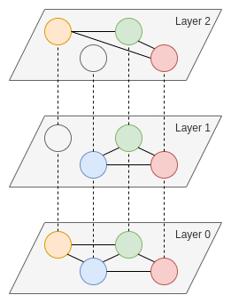

# Multilayer Networks

Multilayer networks are networks with multiple kinds of relations[^1].

Each application built on top of Ziku is one layer, ensuring that the application messages are not routed through peers that are not related with the application.

<figure>

<figcaption align = "center">Image 1</figcaption>
</figure>

Image 1 represents a multilayer network with 3 layers. All nodes are represented in all layers, even if they do not use the application that is represented in that layer (i.e. they don't have any connection to other nodes in that layer).

<figure>

| Application | Layer   | Nodes |
|-------------|---------|-------|
| Ziku P2P    | Layer 0 | Y, B, G, R |
| App1        | Layer 1 | B, G, R |
| App2        | Layer	2 | Y, G, R |

<figcaption align = "center">Table 1</figcaption>
</figure>

Table 1 specifies the applications, the layers and the participating nodes for Image 1.

[^1]: [De Domenico, M.; Solé-Ribalta, A.; Cozzo, E.; Kivelä, M.; Moreno, Y.; Porter, M.; Gómez, S.; Arenas, A. (2013). "Mathematical Formulation of Multilayer Networks"](https://journals.aps.org/prx/abstract/10.1103/PhysRevX.3.041022)